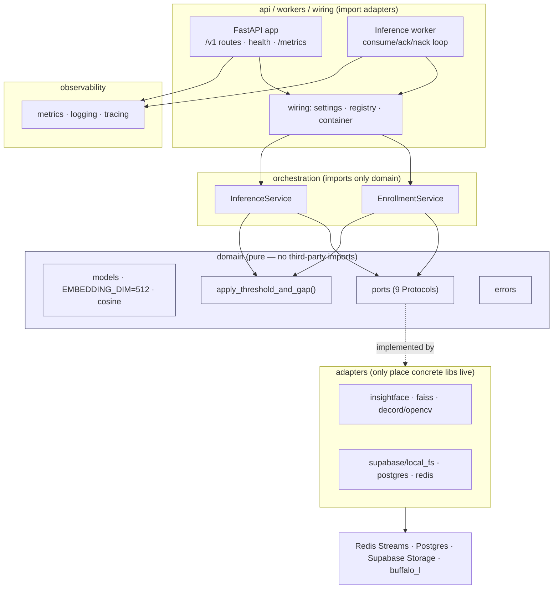

# 00 — System Overview

The ML service is a multi-tenant face-recognition service that distributes event
photos/videos to the students who appear in them. Two pipelines share one
embedding-model version but are otherwise independent: **enrollment** (synchronous
HTTP) and **inference** (async, queue-driven workers).

The design is **hexagonal (ports & adapters)** so the ML stack or storage can be
swapped by configuration alone (NFR-1/NFR-2). See the binding specs at the repo
root (`ml-service-requirements.md`, `ml-service-architecture.md`).

## Layers

**Layering invariant (CI-enforced):** `domain/` and `orchestration/` import no
concrete ML/IO library. Guarded by `tests/test_layering.py` and a grep step in
CI (`.github/workflows/ci.yml`) / `scripts/check.ps1`.

## One image, three roles

The ML service ships as a single Docker image; the container `command` selects
the role (see [08-deployment.md](08-deployment.md)):

| Role | Command | Purpose |
|---|---|---|
| API | `uvicorn ml_service.api.main:app` (default) | Enrollment endpoints, health, `/metrics` |
| Worker | `python -m ml_service.workers.inference_worker` | Consume inference jobs, persist matches |
| Migrate | `alembic … upgrade head` | Apply DB migrations (one-shot, gates the apps) |

## Where to read next

- Pipelines end to end → [03-pipelines.md](03-pipelines.md)
- Wiring + API contracts → [04-api.md](04-api.md)
- Worker delivery semantics → [07-worker.md](07-worker.md)
- Deployment / Docker / GPU → [08-deployment.md](08-deployment.md)
- Metrics / logs / traces → [09-observability.md](09-observability.md)
