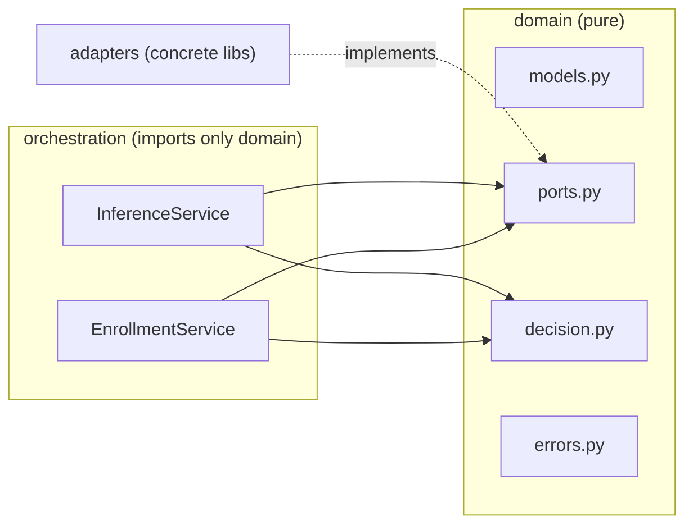
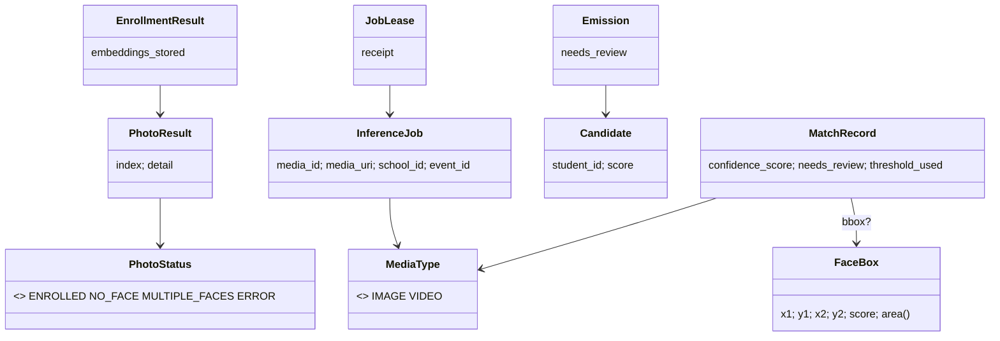
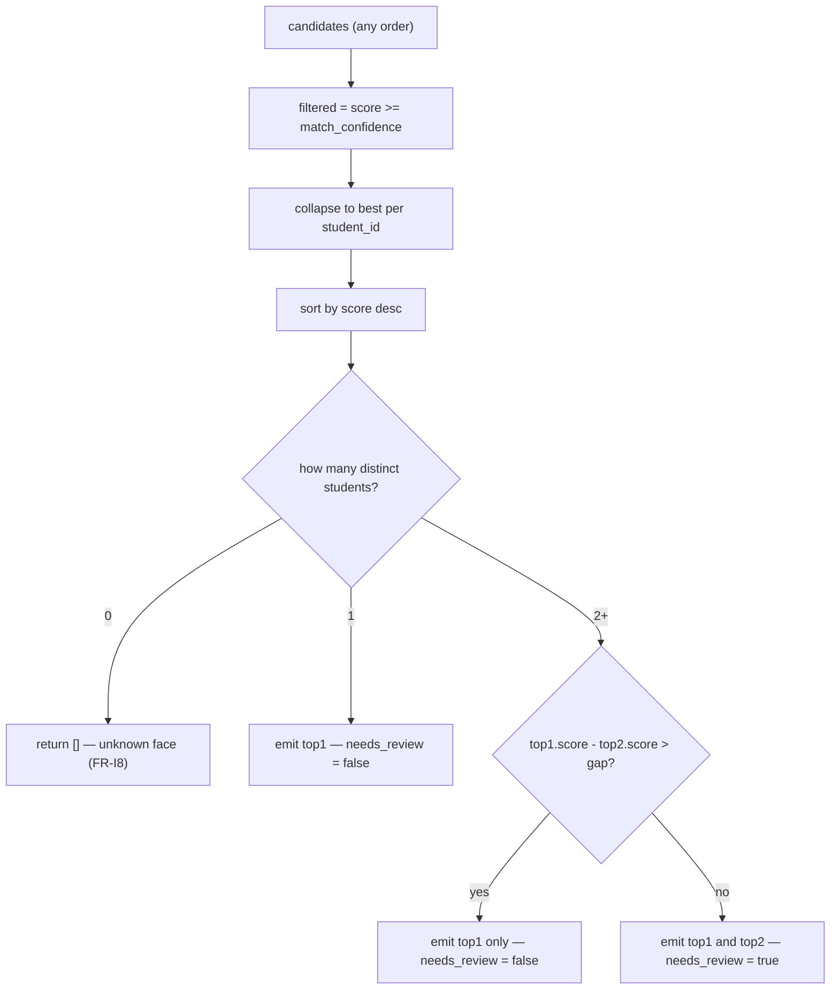
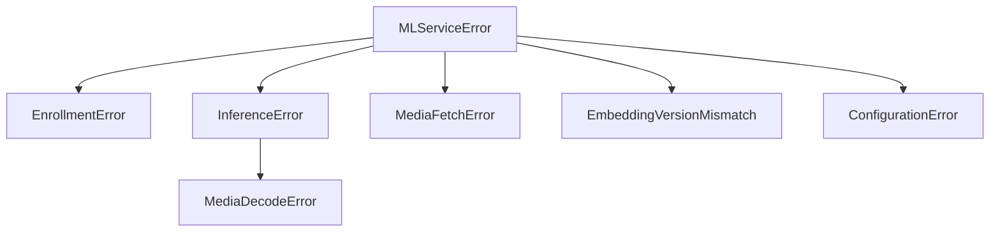

# Domain layer

The `domain/` package is **pure**: it imports no third-party ML/IO library. This
is the foundation of the hexagonal design (NFR-1/NFR-2) and is enforced by
`tests/test_layering.py` (the architecture §5 acceptance test). Everything here
is either a frozen value object, a `Protocol` port, the pure decision function,
or an error type.



## Locked conventions

From architecture §6, defined in `domain/models.py`:

```python
EMBEDDING_DIM = 512          # ArcFace R100 output
SIMILARITY_METRIC = "cosine" # L2-normalized vectors -> inner product
```

`Embedding` validates its length is exactly `EMBEDDING_DIM` on construction, so a
mis-sized vector from any adapter fails fast.

## Value objects (`models.py`)

All are `@dataclass(frozen=True, slots=True)` — immutable and hashable, safe to
pass by value into the pure decision function. Enums are `StrEnum`.

| Type | Key fields | Notes |
|---|---|---|
| `MediaType` | `IMAGE`, `VIDEO` | enum (req §10.3) |
| `PhotoStatus` | `ENROLLED`, `NO_FACE`, `MULTIPLE_FACES`, `ERROR` | per-photo enrollment result (FR-E4) |
| `FaceBox` | `x1,y1,x2,y2,score`; `area` | `area` drives pick-largest (req §8.7) |
| `Embedding` | `vector: tuple[float,...]` | len == 512, L2-normalized |
| `Candidate` | `student_id, score` | a search hit (cosine score) |
| `Thresholds` | `match_confidence, gap` | resolved per school (req §6.1) |
| `Frame` | `image_bytes, timestamp_ms?` | `timestamp_ms` set only for video |
| `InferenceJob` | `media_id, media_uri, school_id, event_id, media_type` | job payload (req §10.3) |
| `MatchRecord` | see req §10.1 | versions/thresholds = values used at decision time (NFR-4); `match_id`/`created_at` are DB-assigned |
| `PhotoResult` | `index, status, detail?` | one entry per enrollment photo |
| `EnrollmentResult` | `school_id, student_id, embeddings_stored, photo_results` | enrollment response |
| `Emission` | `candidate, needs_review` | a decision-function output |
| `JobLease` | `job, receipt` | consumed job + opaque ack handle |
| `JobOutcome` | the req §13 counters + model versions | returned by inference for the worker to emit as metrics |



## Ports (`ports.py`)

Nine `Protocol`s — the eight from requirements §9 plus `ReferencePhotoRepository`
(the student-id-triggered enrollment contract, [decisions/0009](../../../decisions/0009-enrollment-contract.md)).
All are **async** except `VideoFrameExtractor` (a lazy sync iterator, per req §9);
sync ML work is offloaded inside adapters. See
[decisions/0008](../../../decisions/0008-domain-core-design.md).

| Port | Method(s) | Used by |
|---|---|---|
| `FaceDetector` | `version`; `async detect(bytes) -> list[FaceBox]` | both services |
| `FaceEmbedder` | `version`; `async embed(bytes, FaceBox) -> Embedding` | both services |
| `VectorIndex` | `async upsert / search / delete` (school-scoped) | both services |
| `MediaStore` | `async fetch(uri) -> bytes` | both services |
| `VideoFrameExtractor` | `extract(bytes, fps) -> Iterator[Frame]` (sync) | inference |
| `MatchRepository` | `async save_batch / exists` | inference |
| `ThresholdProvider` | `async get_thresholds(school_id) -> Thresholds` | inference |
| `ReferencePhotoRepository` | `async get / replace / delete` (photo URIs) | enrollment |
| `JobQueue` | `async enqueue / ack / nack`; `consume() -> AsyncIterator[JobLease]` | worker (Phase 3) |

Contract highlights:
- **`VectorIndex` is the tenant-isolation boundary** — every call takes `school_id`; there is no cross-school search (NFR-3).
- **`VectorIndex.upsert` takes a batch** and *atomically replaces* the student's vectors (FR-E3) — see [decisions/0008](../../../decisions/0008-domain-core-design.md).
- **`VectorIndex.search` returns candidates sorted by score descending AND at most one per `student_id`** (the student's best); the decision function re-collapses defensively.
- **`JobQueue` uses an explicit lease + ack/nack** for at-least-once delivery (architecture §8.4).

## Decision logic (`decision.py`)

`apply_threshold_and_gap(candidates, thresholds) -> list[Emission]` is pure and
side-effect-free (requirements §6.2). It considers only the top two distinct
students that clear the threshold (after collapsing per student), regardless of
`top_k`.



The gap test is strict `>`: when the gap exactly equals the threshold, the match
is treated as ambiguous (both emitted for review).

## Errors (`errors.py`)



`EmbeddingVersionMismatch` is the "fail loud" signal for a stale-model FAISS index
(architecture §7.3); `MediaFetchError` covers a failed `MediaStore.fetch` in
either pipeline; `MediaDecodeError` covers media that was fetched but cannot be
decoded (corrupt/unsupported) — a permanent, non-retryable failure, distinct from
the transient `MediaFetchError`.
