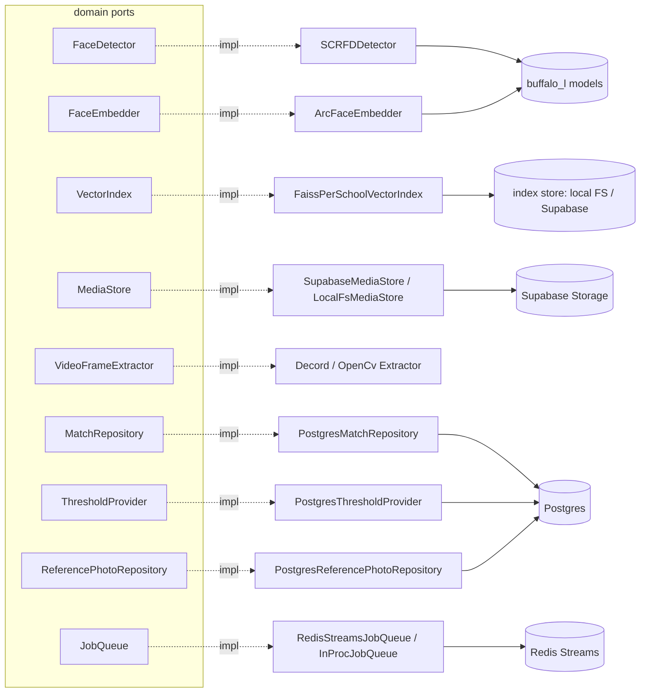

# Adapters

Adapters are the **only** place concrete libraries live (faiss, insightface,
opencv/decord, supabase, sqlalchemy/asyncpg, redis). Each implements one domain
port; `api`/`workers`/`wiring` are the only layers allowed to import them. Swapping
any adapter is a config change (NFR-1/NFR-2) — the pure layers never change.

## Adapter / library table (architecture §6)

| Port | Default adapter | Library | Notes |
|---|---|---|---|
| `FaceDetector` | `SCRFDDetector` | `insightface` (SCRFD `det_10g`) | loads **only** the detector model; returns `FaceBox` + 5 landmarks |
| `FaceEmbedder` | `ArcFaceEmbedder` | `insightface` (ArcFace `w600k_r50`) | loads **only** the recognition model; `norm_crop` align → **L2-normalized** 512-d |
| `VectorIndex` | `FaissPerSchoolVectorIndex` | `faiss-cpu` | `IndexFlatIP` per school; see [06-faiss-lifecycle](06-faiss-lifecycle.md) |
| `MediaStore` | `SupabaseMediaStore` (`LocalFsMediaStore` dev) | `supabase` / `httpx` | media only ([0010](../../../decisions/0010-supabase-media-store.md)) |
| `VideoFrameExtractor` | `DecordFrameExtractor` (`OpenCvFrameExtractor` fallback) | `decord` / `opencv` | fixed-FPS; frames yielded as encoded bytes + `timestamp_ms` |
| `MatchRepository` | `PostgresMatchRepository` | `sqlalchemy[asyncio]` + `asyncpg` | `save_batch` = `INSERT … ON CONFLICT`, higher confidence wins |
| `ThresholdProvider` | `PostgresThresholdProvider` | same | `school_thresholds`, null → default; 60s read-through cache |
| `ReferencePhotoRepository` | `PostgresReferencePhotoRepository` | same | `student_reference_photos`; `replace` = delete+insert |
| `JobQueue` | `RedisStreamsJobQueue` (`InProcJobQueue` dev/test) | `redis` | consumer group, `XAUTOCLAIM`, dead-letter ([0014](../../../decisions/0014-queue-and-platform-adapters.md)) |

## Cross-cutting adapter conventions

- **Separate detector/embedder modules (NFR-1).** Both models ship in `buffalo_l`,
  but each adapter loads only its half; they communicate solely through the domain
  `FaceBox` (landmarks ride inside it — [0013](../../../decisions/0013-facebox-landmarks.md)).
- **Normalized vectors everywhere.** The embedder L2-normalizes; the FAISS adapter
  uses `IndexFlatIP`, so inner product == cosine. `EMBEDDING_DIM=512` is validated
  on `Embedding` construction, so a mis-sized vector fails fast.
- **Sync work is offloaded.** insightface/faiss/file/network calls are wrapped in
  `anyio.to_thread.run_sync` so the async ports never block the event loop. The
  video extractor stays a sync lazy iterator per the port.
- **Secrets** (Supabase key, DB password) are injected by wiring from the
  environment — never stored in code or committed.
- **Platform markers.** `insightface` and `decord` are Linux-only wheels (they run
  in Docker); Windows dev uses the OpenCV extractor + import-gated tests.

## Tests

`faiss`, the local index store, the local-fs media store, the in-proc queue, and
the OpenCV extractor run everywhere (CPU, no models). The insightface, Postgres,
and Redis adapters are covered by tests gated on `pytest.importorskip` / env vars
(`ML_MODEL_DIR`, `ML_TEST_FACE_IMAGE`, `ML_TEST_DATABASE_URL`, `ML_TEST_REDIS_URL`)
so CI/Windows dev stays green while real backends are exercised when present.
