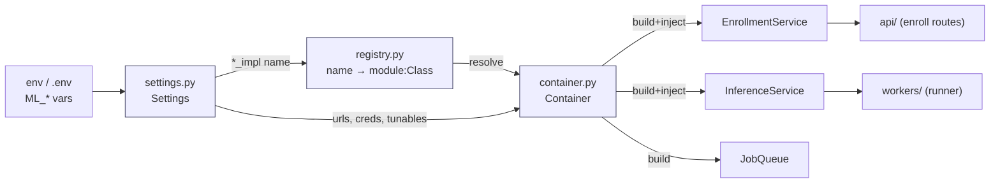
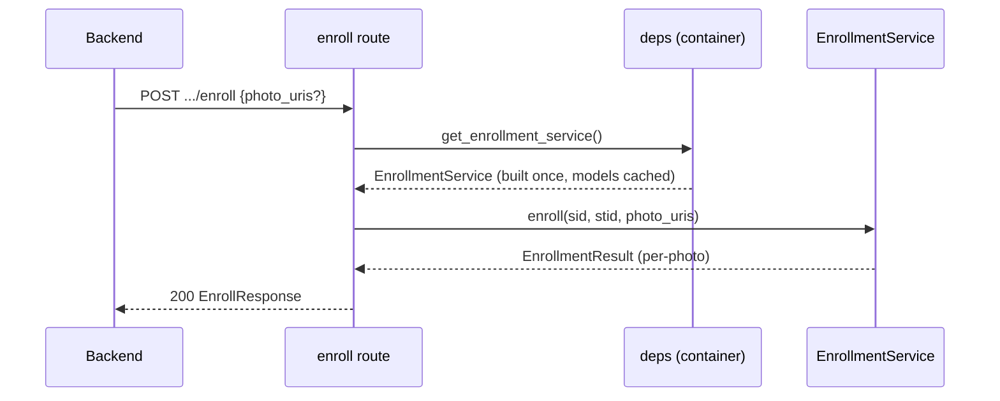

# API & Wiring (Phase 3)

The API is a thin FastAPI shell over the composition root. It owns HTTP shape and
error mapping only — all logic lives in `EnrollmentService`. The **wiring** layer
(`settings` → `registry` → `container`) is what makes NFR-1/NFR-2 real: swap any
adapter by changing a `settings.*_impl` env var, no code change.

## Wiring: settings → registry → container



- **`settings.py`** — the whole tunable surface (req §12): decision thresholds,
  `video_sample_fps`, `top_k`, the `*_impl` selectors, backing-store URLs, and
  Supabase credentials. `ML_`-prefixed env vars; secrets come from the
  environment and are never committed.
- **`registry.py`** — a flat `name → "module:Class"` table per port.
  `resolve()` imports the class lazily, so a Linux-only adapter (insightface,
  decord) is only imported when actually selected — Windows dev stays importable.
- **`container.py`** — reads each selector, resolves the class, constructs it
  with the impl-appropriate config, and memoizes it. Built once and shared: the
  detector/embedder models load a single time; the FAISS per-school cache and the
  DB engine are shared between the enrollment and inference services. Nothing is
  built until first requested — an API pod never constructs the queue; a worker
  never constructs the reference-photo repo.

The container is a process-wide singleton (`api/deps.py::get_container`, memoized).
Building the enrollment service (which loads models) is offloaded to a threadpool
so the event loop never blocks. Tests inject a service via
`app.dependency_overrides`.

## Endpoints

| Method | Path | Body | Success | Notes |
|---|---|---|---|---|
| `POST` | `/v1/schools/{school_id}/students/{student_id}/enroll` | `{ "photo_uris"?: string[] }` | `200` `EnrollResponse` | with `photo_uris` = register+enroll; without = refresh from stored URIs (0009) |
| `DELETE` | `/v1/schools/{school_id}/students/{student_id}` | — | `204` | removes embeddings + stored URIs (FR-E2) |
| `GET` | `/healthz` | — | `200` `{status:"ok"}` | liveness |
| `GET` | `/readyz` | — | `200`/`503` | pings configured Postgres/Redis once the container is wired |

`EnrollResponse`:

```json
{
  "school_id": "school-1",
  "student_id": "stu-1",
  "embeddings_stored": 1,
  "photo_results": [{ "index": 0, "status": "enrolled", "detail": null }]
}
```

`photo_results[].status` ∈ `enrolled | no_face | multiple_faces | error` — one per
reference photo. Per-photo failures don't fail the request (FR-E4); they surface
as a non-`enrolled` status with a `detail` string.

## Enrollment request flow



## Error mapping

Domain errors are mapped centrally (`api/main.py`), so routes stay clean:

| Exception | HTTP | When |
|---|---|---|
| `EnrollmentError` | `400` | empty `photo_uris` (use `DELETE` to clear a student) |
| `MLServiceError` (base) | `500` | configuration / dependency failures (e.g. `ConfigurationError`, `EmbeddingVersionMismatch`) |
| pydantic validation | `422` | malformed body (FastAPI default) |

Enrollment isolates per-photo failures inside the service, so `MediaFetchError` /
detect / embed errors become a per-photo `error` status rather than an HTTP error.

## `/readyz` behaviour

Once the app has wired its container (set on `app.state.container` at startup),
`/readyz` pings only the infra this deployment uses — Postgres when a postgres
repo is selected, Redis when the redis queue is selected — and returns `503` with
a per-dependency map if any is down. Before wiring (a bare `TestClient(app)` with
no lifespan), it reports `ready`, so unit tests need no live backends.
