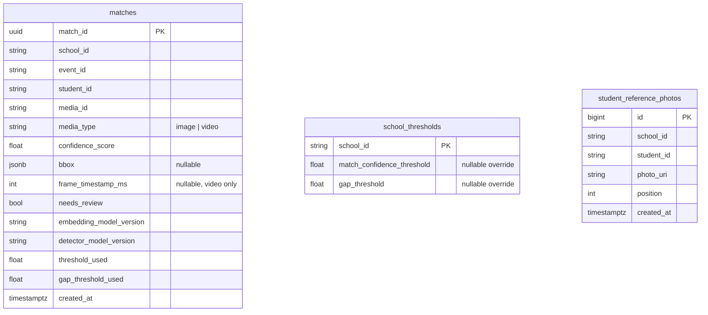

# Data model

The ML service owns its own Postgres metadata DB. All schema is created by Alembic
migrations ([0007](../../../decisions/0007-db-migrations-in-migration-folder.md),
[0012](../../../decisions/0012-db-schema-and-alembic.md)); application code only
assumes what a migration established. ORM models in `db/models.py` mirror
`0001_initial` exactly.

## `matches` (req §10.1)

- **Unique `(media_id, student_id)`** (`uq_matches_media_student`) — the DB-side
  idempotency guard (NFR-5), second line behind the worker's in-memory dedupe.
- Indexes `(school_id, event_id)` (core's fan-out queries) and
  `(school_id, student_id)` (per-student retrieval).
- `match_id` is a **client-side UUID** (`uuid4` default) — no `pgcrypto` needed;
  `created_at` uses a `now()` server default.
- Reproducibility (NFR-4): `embedding_model_version`, `detector_model_version`,
  `threshold_used`, `gap_threshold_used` are the values used **at decision time**,
  written by the worker — never re-read at write time.
- Write path is `save_batch` only, using
  `INSERT … ON CONFLICT (media_id, student_id) DO UPDATE … WHERE
  EXCLUDED.confidence_score > matches.confidence_score` — a higher-confidence
  reprocess upgrades the row in place (architecture §8.2).

## `school_thresholds` (req §10.2)

ML owns these two nullable override columns rather than reading the core's
`schools` table (isolation + the "ML never calls BE" rule). A missing row or a
null column falls back to the global default from config; the provider caches
per-school for 60s.

## `student_reference_photos` (decisions/0009)

Backs student-id-triggered enrollment: `EnrollmentService` reads a student's photo
URIs through `ReferencePhotoRepository` and fetches bytes via `MediaStore`.
`position` preserves order; `replace` is a delete-then-insert in one transaction
(replace-not-append). Indexed `(school_id, student_id)`.
