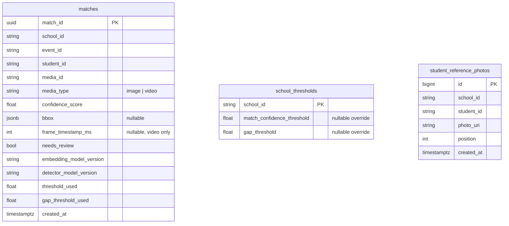
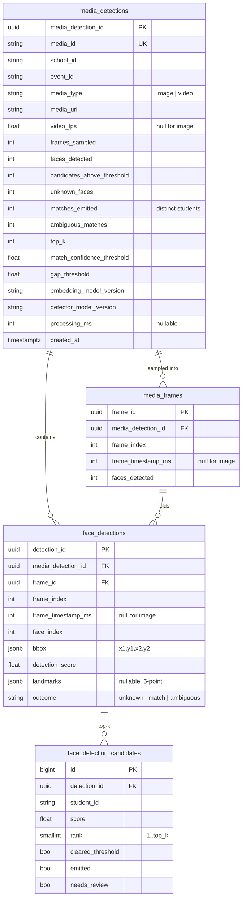

# Data model — what the DB stores

The ML service owns its own Postgres metadata DB. All schema is created by Alembic
migrations ([0007](../../../decisions/0007-db-migrations-in-migration-folder.md),
[0012](../../../decisions/0012-db-schema-and-alembic.md)); application code only assumes
what a migration established, and ORM models in `db/models.py` mirror the migrations
exactly.

This doc is the canonical reference for **exactly what is persisted**. Two parts:

- **[A. Current schema](#a-current-schema-migration-0001)** — the three tables that exist
  today (migration `0001`).
- **[B. Detection detail](#b-detection-detail--the-two-views-of-a-pass)** — the tables +
  view that persist the full per-face / per-frame detail (migration `0002`,
  decisions/0021).

---

## A. Current schema (migration `0001`)



### `matches` (req §10.1) — the detection output

**This is the only table detection writes today.** The inference worker processes one
media item, then writes **one deduped row per `(media_id, student_id)`** — the *best* hit
for each identified student across the **whole** media. A student who appears in many
frames still produces a single row (their highest-confidence appearance).

| Column | Type | Null | What it stores |
|---|---|---|---|
| `match_id` | uuid | no | Primary key (client-side `uuid4`). |
| `school_id` | string | no | Tenant. Every match is scoped to one school. |
| `event_id` | string | no | The event this media belongs to. |
| `student_id` | string | no | The identified student (this service uses the id as the name). |
| `media_id` | string | no | The photo/video that was matched. |
| `media_type` | string | no | `image` or `video`. |
| `confidence_score` | float | no | The student's **best** similarity score in this media. |
| `bbox` | jsonb | yes | Face box of the best hit — `{x1,y1,x2,y2,score}`. |
| `frame_timestamp_ms` | int | yes | Which frame the best hit came from (video only). |
| `needs_review` | bool | no | True when the match was ambiguous (decision §6.2). |
| `embedding_model_version` | string | no | Embedder version used **at decision time** (NFR-4). |
| `detector_model_version` | string | no | Detector version used at decision time. |
| `threshold_used` | float | no | Match-confidence threshold applied. |
| `gap_threshold_used` | float | no | Gap threshold applied. |
| `created_at` | timestamptz | no | Insert time (`now()` server default). |

- **Idempotency:** unique `(media_id, student_id)` (`uq_matches_media_student`) — the
  DB-side guard (NFR-5) behind the worker's in-memory dedupe.
- **Indexes:** `(school_id, event_id)` and `(school_id, student_id)`.
- **Write path:** `save_batch` only, `INSERT … ON CONFLICT (media_id, student_id) DO
  UPDATE … WHERE EXCLUDED.confidence_score > matches.confidence_score` — a higher-
  confidence reprocess upgrades the row in place; a lower one is ignored.
- **Reproducibility (NFR-4):** the four version/threshold columns are the values used at
  decision time — never re-read at write time.

### `school_thresholds` (req §10.2)

Per-school threshold **overrides** — configuration, not detection output. ML owns these
two nullable columns rather than reading the core's `schools` table. Missing row / null →
global default from config; the provider caches per-school for 60s.

| Column | Type | Null | What it stores |
|---|---|---|---|
| `school_id` | string | no | Primary key. |
| `match_confidence_threshold` | float | yes | Override; null → global default. |
| `gap_threshold` | float | yes | Override; null → global default. |

### `student_reference_photos` (decisions/0009)

Reference-photo URIs backing student-id-triggered enrollment — enrollment **input**.

| Column | Type | Null | What it stores |
|---|---|---|---|
| `id` | bigint | no | Primary key (autoincrement). |
| `school_id` | string | no | Tenant. |
| `student_id` | string | no | The student these photos enroll. |
| `photo_uri` | string | no | Storage URI of one reference photo. |
| `position` | int | no | 0-based order within the student's photo set (stable reads). |
| `created_at` | timestamptz | no | Insert time. |

Indexed `(school_id, student_id)`. `replace` is delete-then-insert in one transaction.

### What is **NOT** stored today

`matches` is a deduped *summary*, so detection currently keeps only *"these students were
in this media, with their best score."* Everything else computed during inference is
**discarded**:

- **Unmatched (unknown) faces** — a detected face that matched nobody produces no row.
- **The `top_k` value** used for the search.
- **The per-face top-k candidates** — the other students the search returned, and scores.
- **The full per-frame video timeline** — a person in 5 frames yields **one** `matches`
  row (their best frame); the other four appearances are lost.

Part B proposes storing all of it.

---

## B. Detection detail — the two views of a pass

> Built by migration `0002` (decisions/0021). `matches` (Part A) keeps working exactly
> as-is; everything below is **additive** — it does not change the matches contract.

One inference pass is persisted as **two complementary views**:

- **Detection = media-centric** (`media_detections → media_frames → face_detections →
  face_detection_candidates`): *what the image/video consists of and how each identity was
  determined* — every face (matched or not), every sampled frame, and each face's raw
  top-k candidates with scores + the threshold/`top_k`/versions used. This is the
  immutable **evidence**.
- **Matches = student-centric** (`matches` + the `student_media_appearances` **view**):
  *is student X present, and where* — the deduped best hit (unchanged) plus, via the view,
  **all** of that student's appearances (every frame + box). This is the resolved
  **conclusion**.



**Idempotency = replace-by-media.** Reprocessing a media deletes its `media_detections`
row (the FK cascade wipes its frames, faces, and candidates) and re-inserts the whole
tree — the per-media evidence is regenerated deterministically. All in one transaction,
with a per-`media_id` advisory lock so two workers can't race the delete+insert. (This is
a *second* idempotency model, distinct from `matches`' higher-confidence-wins upsert — see
[Two idempotency models](#two-idempotency-models).)

### `media_detections` — one row per processed media

The media-level summary: what the media consists of and how it was processed. Counts come
straight from the worker's `JobOutcome` (today emitted to Prometheus, then lost).

| Column | Type | Null | What it stores |
|---|---|---|---|
| `media_detection_id` | uuid | no | Primary key. |
| `media_id` | string | no | The media processed. **Unique** (replace-by-media target). |
| `school_id` | string | no | Tenant. |
| `event_id` | string | no | The event this media belongs to. |
| `media_type` | string | no | `image` or `video`. |
| `media_uri` | string | no | Where the media was fetched from. |
| `video_fps` | float | yes | Sampling rate used (null for an image). |
| `frames_sampled` | int | no | How many frames were processed (1 for an image). |
| `faces_detected` | int | no | Total faces found across all frames. |
| `candidates_above_threshold` | int | no | Per-face distinct students that cleared the threshold, summed. |
| `unknown_faces` | int | no | Faces that matched nobody. |
| `matches_emitted` | int | no | Distinct students matched (= rows written to `matches`). |
| `ambiguous_matches` | int | no | Emitted matches flagged `needs_review`. |
| `top_k` | int | no | Search `top_k` used. |
| `match_confidence_threshold` | float | no | Match threshold applied (decision time). |
| `gap_threshold` | float | no | Gap threshold applied (decision time). |
| `embedding_model_version` | string | no | Embedder version (decision time). |
| `detector_model_version` | string | no | Detector version (decision time). |
| `processing_ms` | int | yes | End-to-end processing time, if measured. |
| `created_at` | timestamptz | no | Insert time. |

Indexes: `(school_id, event_id)`, `(school_id, created_at)`. Unique: `(media_id)`.

> **Count granularity:** `faces_detected` / `unknown_faces` / `candidates_above_threshold`
> are **per-face** totals; `matches_emitted` / `ambiguous_matches` are deduped
> **per-student** (they mirror the `matches` rows and `JobOutcome`). For a per-face
> outcome breakdown, read `face_detections.outcome`.

### `media_frames` — one row per sampled frame

Records the frames a video was sampled into, **including frames with zero faces** (so
"frame processed but empty" is distinguishable from "frame never sampled"). An image is a
single degenerate row (`frame_index=0`, `frame_timestamp_ms=null`).

| Column | Type | Null | What it stores |
|---|---|---|---|
| `frame_id` | uuid | no | Primary key. |
| `media_detection_id` | uuid | no | FK → `media_detections` (**ON DELETE CASCADE**). |
| `frame_index` | int | no | 0-based sampled-frame ordinal. |
| `frame_timestamp_ms` | int | yes | Frame time in ms (null for an image). |
| `faces_detected` | int | no | Number of faces found in this frame. |

Unique `(media_detection_id, frame_index)`; index `(media_detection_id)`.

### `face_detections` — one row per detected face

Every face the detector found, in every frame — **including unknowns** (faces that matched
nobody, which never reach `matches`). This is the first time unknown faces are persisted.

| Column | Type | Null | What it stores |
|---|---|---|---|
| `detection_id` | uuid | no | Primary key. |
| `media_detection_id` | uuid | no | FK → `media_detections` (cascade); denormalized for direct media→face queries. |
| `frame_id` | uuid | no | FK → `media_frames` (cascade). |
| `frame_index` | int | no | The frame's ordinal (denormalized; part of the unique key). |
| `frame_timestamp_ms` | int | yes | Frame time (null for an image). |
| `face_index` | int | no | 0-based face ordinal within the frame. |
| `bbox` | jsonb | no | The face rectangle — `{x1,y1,x2,y2}`. |
| `detection_score` | float | no | Detector confidence that this region is a face (distinct from match score). |
| `landmarks` | jsonb | yes | 5-point facial landmarks, when the detector provided them (today silently dropped). |
| `outcome` | string | no | Decision for this face: `unknown` (0 emitted), `match` (1), `ambiguous` (2, needs review). |

Unique `(media_detection_id, frame_index, face_index)`; index `(media_detection_id)`.

### `face_detection_candidates` — per-face top-k audit trail

For each detected face, the **raw vector-search results** — up to `top_k`, one per
student, sorted by score. This includes candidates **below** the threshold and the
closest-but-missed student on an *unknown* face — the richest signal for tuning thresholds
and explaining why a face was unknown or ambiguous.

| Column | Type | Null | What it stores |
|---|---|---|---|
| `id` | bigint | no | Primary key (identity). |
| `detection_id` | uuid | no | FK → `face_detections` (**ON DELETE CASCADE**). |
| `student_id` | string | no | The candidate the search returned. |
| `score` | float | no | That candidate's similarity score. |
| `rank` | smallint | no | 1-based position in the top-k (1 = best). |
| `cleared_threshold` | bool | no | Whether `score ≥ match_confidence_threshold`. |
| `emitted` | bool | no | Whether it survived the gap decision (was written to `matches`). |
| `needs_review` | bool | no | Whether it was emitted as part of an ambiguous pair. |

Unique `(detection_id, rank)`; indexes `(detection_id)` and `(student_id)`.

> The shared identify kernel retains the raw `list[Candidate]` from each search
> (`FaceResult.candidates`, `orchestration/identify.py`) so these rows — including
> below-threshold hits and the closest-but-missed on an unknown face — are persisted
> (decisions/0021).

### `matches` — student-centric (enhanced, still Part A's table)

`matches` is unchanged except for **one added column**; it stays one deduped row per
`(media_id, student_id)` with higher-confidence-wins idempotency.

| Added column | Type | Null | What it stores |
|---|---|---|---|
| `frames_matched` | int | no | How many frames this student was emitted in (1 for an image). Default `0`. |

All existing columns keep their meaning. The full "all frames + boxes for this student"
list is **not** copied here — it is derived from the detection evidence via the view
below (so it can never drift from what the detection tables say).

### `student_media_appearances` — the student-centric view

A DB **view** (no stored rows) that answers *"where does student X appear in media Y?"*
by reading the emitted candidates back through the detection tables:

```sql
CREATE VIEW student_media_appearances AS
SELECT md.school_id, md.event_id, c.student_id, md.media_id,
       fd.frame_index, fd.frame_timestamp_ms, fd.bbox, c.score, c.needs_review
FROM   face_detection_candidates c
JOIN   face_detections  fd ON fd.detection_id = c.detection_id
JOIN   media_detections md ON md.media_detection_id = fd.media_detection_id
WHERE  c.emitted = true;
```

One row per emitted appearance — a student in 5 frames yields 5 rows here (one `matches`
row, `frames_matched=5`).

### Two idempotency models

The two views deliberately use different write semantics — worth stating plainly:

| | Detection tables | `matches` |
|---|---|---|
| Role | Immutable **evidence** of the latest pass | Resolved **conclusion** |
| Idempotency | **Replace-by-media** (delete + re-insert the whole tree) | **Higher-confidence-wins** upsert (`ON CONFLICT`) |
| On a *lower*-confidence reprocess | Rewritten to the new pass | Keeps the old (higher) row |

Because they can reflect different passes after a lower-confidence reprocess, appearances
are **derived** from the detection side (the view) rather than copied onto `matches` —
that removes any chance of the two disagreeing. The `matches` and detection writes run in
**separate transactions**, but each path is independently idempotent (higher-wins upsert /
replace-by-media), so a partial failure self-heals on the worker's retry.

### Explicitly NOT stored (non-goals)

- **Face embeddings** (the 512-d query vectors per face) — re-derivable from the retained
  media + the stamped model versions, and far too voluminous to keep per face per frame.
  If re-matching without re-processing ever becomes a need, the documented path is a
  separate opt-in table using the `pgvector` extension — not a column on the hot tables.
- **Frame width/height** — not exposed by the domain `Frame` (only bytes + timestamp), so
  stored boxes are raw pixel coordinates. Threading dimensions through the domain (to
  enable normalized/renderable boxes) is a possible future addition, not part of this
  design.

### Worked example — what actually lands in each table

A **video** `media_id="vidX"` (`event_id="ev1"`, `school_id="sch1"`), sampled at 2 frames
(`t=0ms`, `t=1000ms`), `top_k=2`, match threshold `0.65`, gap `0.08`:

- **Frame 0 (`t=0`)** — 2 faces:
  - Face 0: search → `alice 0.91`, `bob 0.40` → alice clears, bob doesn't → **match alice**.
  - Face 1: search → `carol 0.72`, `dave 0.66` → both clear, gap `0.06 < 0.08` → **ambiguous** (carol + dave, needs review).
- **Frame 1 (`t=1000`)** — 1 face:
  - Face 0: search → `alice 0.88`, `bob 0.30` → **match alice**.

Rows written:

| Table | Rows |
|---|---|
| `media_detections` | **1** — `frames_sampled=2`, `faces_detected=3`, `candidates_above_threshold=4`, `unknown_faces=0`, `matches_emitted=3`, `ambiguous_matches=2`, plus `top_k=2`, thresholds, versions. |
| `media_frames` | **2** — (`frame_index=0, t=0, faces_detected=2`), (`frame_index=1, t=1000, faces_detected=1`). |
| `face_detections` | **3** — (f0,face0 → `match`), (f0,face1 → `ambiguous`), (f1,face0 → `match`); each with its bbox + `detection_score`. |
| `face_detection_candidates` | **6** — f0face0: `alice`(rank1, cleared, emitted), `bob`(rank2, not-cleared, not-emitted); f0face1: `carol`(rank1, cleared, emitted, needs_review), `dave`(rank2, cleared, emitted, needs_review); f1face0: `alice`(rank1, cleared, emitted), `bob`(rank2, not-cleared, not-emitted). |
| `matches` (unchanged shape) | **3** — `alice`(best `0.91` @ `t=0`, `frames_matched=2`), `carol`(`0.72`, needs_review, `frames_matched=1`), `dave`(`0.66`, needs_review, `frames_matched=1`). |
| `student_media_appearances` (view) | **4** — `alice`@`t=0`(0.91), `alice`@`t=1000`(0.88), `carol`@`t=0`(0.72), `dave`@`t=0`(0.66). Alice appears **twice** here but is **one** `matches` row. |

This is the crux: the **detection** side captures the media exhaustively (every face,
every frame, every candidate — alice's two appearances included), while **matches** stays
the deduped per-student conclusion; the **view** bridges them for the student-centric
question without duplicating a single byte.
