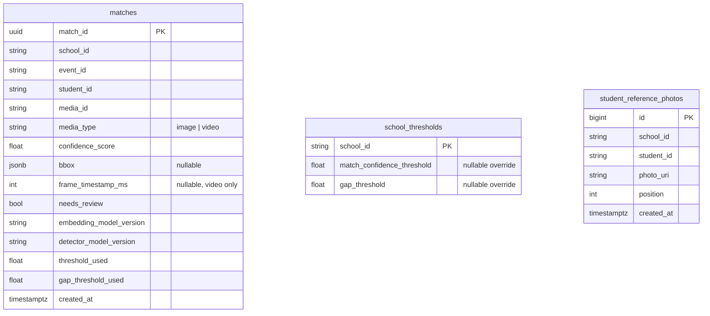
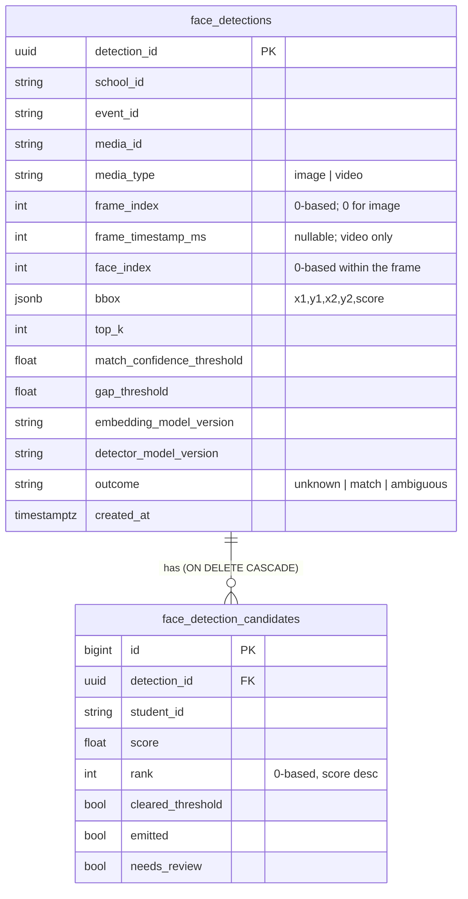

# Data model — what the DB stores

The ML service owns its own Postgres metadata DB. All schema is created by Alembic
migrations ([0007](../../../decisions/0007-db-migrations-in-migration-folder.md),
[0012](../../../decisions/0012-db-schema-and-alembic.md)); application code only assumes
what a migration established, and ORM models in `db/models.py` mirror the migrations
exactly.

This doc is the canonical reference for **exactly what is persisted**. It has two parts:

- **[A. Current schema](#a-current-schema-migration-0001)** — the three tables that exist
  today (migration `0001`).
- **[B. Proposed detection detail](#b-proposed--per-frame--per-face-detection-detail)** —
  two tables that would persist the full per-face / per-frame detail. **Proposed only —
  not yet built** (no migration, no ORM). Included here so the design can be reviewed
  before any code lands.

---

## A. Current schema (migration `0001`)

### `matches` (req §10.1) — the detection output

**This is the only table detection writes today.** The inference worker processes one
media item, then writes **one deduped row per `(media_id, student_id)`** — the *best*
hit for each identified student across the **whole** media. A student who appears in many
frames still produces a single row (their highest-confidence appearance).

| Column | Type | Null | What it stores |
|---|---|---|---|
| `match_id` | uuid | no | Primary key (client-side `uuid4`). |
| `school_id` | string | no | Tenant. Every match is scoped to one school. |
| `event_id` | string | no | The event this media belongs to. |
| `student_id` | string | no | The identified student (this service uses the id as the name). |
| `media_id` | string | no | The photo/video that was matched. |
| `media_type` | string | no | `image` or `video`. |
| `confidence_score` | float | no | The student's **best** similarity score in this media. |
| `bbox` | jsonb | yes | Face box of the best hit — `{x1,y1,x2,y2,score}`. |
| `frame_timestamp_ms` | int | yes | Which frame the best hit came from (video only). |
| `needs_review` | bool | no | True when the match was ambiguous (see decision §6.2). |
| `embedding_model_version` | string | no | Embedder version used **at decision time** (NFR-4). |
| `detector_model_version` | string | no | Detector version used at decision time. |
| `threshold_used` | float | no | Match-confidence threshold applied. |
| `gap_threshold_used` | float | no | Gap threshold applied. |
| `created_at` | timestamptz | no | Insert time (`now()` server default). |

- **Idempotency:** unique `(media_id, student_id)` (`uq_matches_media_student`) — the
  DB-side guard (NFR-5) behind the worker's in-memory dedupe.
- **Indexes:** `(school_id, event_id)` (core's fan-out queries) and
  `(school_id, student_id)` (per-student retrieval).
- **Write path:** `save_batch` only, using
  `INSERT … ON CONFLICT (media_id, student_id) DO UPDATE … WHERE
  EXCLUDED.confidence_score > matches.confidence_score` — a higher-confidence reprocess
  upgrades the row in place; a lower one is ignored.
- **Reproducibility (NFR-4):** the four version/threshold columns are the values used at
  decision time, written by the worker — never re-read at write time.

### `school_thresholds` (req §10.2)

Per-school threshold **overrides** — configuration, not detection output. ML owns these
two nullable columns rather than reading the core's `schools` table (tenant isolation +
the "ML never calls BE" rule). A missing row or a null column falls back to the global
default from config; the provider caches per-school for 60s.

| Column | Type | Null | What it stores |
|---|---|---|---|
| `school_id` | string | no | Primary key. |
| `match_confidence_threshold` | float | yes | Override; null → global default. |
| `gap_threshold` | float | yes | Override; null → global default. |

### `student_reference_photos` (decisions/0009)

Reference-photo URIs backing student-id-triggered enrollment — enrollment **input**, not
detection output. `EnrollmentService` reads a student's URIs through
`ReferencePhotoRepository` and fetches the bytes via `MediaStore`.

| Column | Type | Null | What it stores |
|---|---|---|---|
| `id` | bigint | no | Primary key (autoincrement). |
| `school_id` | string | no | Tenant. |
| `student_id` | string | no | The student these photos enroll. |
| `photo_uri` | string | no | Storage URI of one reference photo. |
| `position` | int | no | Order within the student's photo set. |
| `created_at` | timestamptz | no | Insert time. |

Indexed `(school_id, student_id)`. `replace` is a delete-then-insert in one transaction
(replace-not-append).

### What is **NOT** stored today

`matches` is a deduped *summary*, so at detection time the DB currently keeps **only**
*"these students were in this media, with their best score."* The following are computed
during inference and then **discarded**:

- **Unmatched (unknown) faces** — a detected face that matched nobody produces no row.
- **The `top_k` value** used for the search.
- **The per-face top-k candidates** — the other students the vector search returned for a
  face, and their scores.
- **The full per-frame video timeline** — a person seen in 5 frames yields **one**
  `matches` row (their single best frame); the other four appearances are lost.

Part B proposes storing exactly these.

---

## B. Proposed — per-frame / per-face detection detail

> **Status: PROPOSED (next phase). These tables do not exist yet** — there is no
> migration and no ORM for them. `matches` (Part A) stays **unchanged**; the tables below
> are **purely additive** detail. This section documents the intended design so it can be
> reviewed and locked before any code is written.

**Goal:** at detection time, persist *everything* — every detected face (matched or not),
the `top_k` used, each face's raw top-k candidates with their scores and the threshold
applied, and for video the full per-frame timeline (a person in 5 frames → 5 face rows,
one per timestamp).

Two tables, parent → child: one **detection** per detected face; each detection has
`0..top_k` **candidates**.

### `face_detections` — one row per detected face

One row for **every** face the detector found, in **every** frame (a still image is a
single frame). Written by the worker after processing a media, alongside the existing
`matches` write.

| Column | Type | Null | What it stores |
|---|---|---|---|
| `detection_id` | uuid | no | Primary key (client-side `uuid4`). |
| `school_id` | string | no | Tenant. |
| `event_id` | string | no | The event this media belongs to. |
| `media_id` | string | no | The photo/video processed. |
| `media_type` | string | no | `image` or `video`. |
| `frame_index` | int | no | 0-based sampled-frame ordinal (`0` for an image). |
| `frame_timestamp_ms` | int | yes | Frame time in ms (video only; null for an image). |
| `face_index` | int | no | 0-based face ordinal within the frame. |
| `bbox` | jsonb | no | The detected face box — `{x1,y1,x2,y2,score}`. |
| `top_k` | int | no | The `top_k` used for this face's vector search. |
| `match_confidence_threshold` | float | no | Match threshold applied (decision time). |
| `gap_threshold` | float | no | Gap threshold applied (decision time). |
| `embedding_model_version` | string | no | Embedder version (decision time). |
| `detector_model_version` | string | no | Detector version (decision time). |
| `outcome` | string | no | Decision for this face: `unknown` (0 emitted), `match` (1), or `ambiguous` (2, needs review). |
| `created_at` | timestamptz | no | Insert time. |

- **Unique** `(media_id, frame_index, face_index)` (`uq_face_detections_media_frame_face`)
  — a double-insert guard.
- **Indexes:** `(school_id, media_id)` (fetch a media's detections) and
  `(school_id, event_id)`.

### `face_detection_candidates` — per-face top-k audit trail

For each detected face, the **raw vector-search results** (up to `top_k`, one per student,
sorted by score desc), each flagged with how the decision treated it. This is what makes
the stored top-k fully auditable.

| Column | Type | Null | What it stores |
|---|---|---|---|
| `id` | bigint | no | Primary key (autoincrement). |
| `detection_id` | uuid | no | FK → `face_detections.detection_id` (**ON DELETE CASCADE**). |
| `student_id` | string | no | The candidate student the search returned. |
| `score` | float | no | That candidate's similarity score. |
| `rank` | int | no | 0-based position in the top-k (score desc). |
| `cleared_threshold` | bool | no | Whether `score ≥ match_confidence_threshold`. |
| `emitted` | bool | no | Whether this candidate survived the gap decision (was written to `matches`). |
| `needs_review` | bool | no | Whether it was emitted as part of an ambiguous pair. |

- **Index:** `(detection_id)` (fetch a face's candidates).

### Design notes

- **`matches` is unchanged** — it remains the deduped best-per-student summary. These two
  tables are additive detail; nothing about the existing write path or contract changes.
- **Idempotency = replace-by-media.** Reprocessing a media deletes its `face_detections`
  rows (the FK cascade removes their candidates) and re-inserts fresh — the per-media
  detection set is regenerated deterministically. (`matches` keeps its own
  higher-confidence-wins idempotency.)
- **FK cascade** keeps parent/child consistent and makes the replace clean; this is the
  first foreign key in the ML schema (prior tables had none).
- **Volume.** Per-frame rows can be a firehose (a 10-min video at 1 fps ≈ 600 frames ×
  faces × `top_k` candidate rows), so persistence would be default-on with an
  `ML_PERSIST_DETECTIONS` kill-switch.

### Worked example — what actually lands in each table

A **video** `media_id = "vidX"`, sampled at 2 frames (`t=0ms`, `t=1000ms`), `top_k=2`,
match threshold `0.65`, gap `0.08`:

- **Frame 0 (`t=0`)** — 2 faces:
  - Face 0: search → `alice 0.91`, `bob 0.40` → alice clears, bob does not → **match alice**.
  - Face 1: search → `carol 0.72`, `dave 0.66` → both clear, gap `0.06 < 0.08` → **ambiguous** (carol + dave, needs review).
- **Frame 1 (`t=1000`)** — 1 face:
  - Face 0: search → `alice 0.88`, `bob 0.30` → **match alice**.

Resulting rows:

| Table | Rows written |
|---|---|
| `face_detections` | **3** — (f0,face0 → `match`), (f0,face1 → `ambiguous`), (f1,face0 → `match`); each stamps `top_k=2`, both thresholds, and the model versions. |
| `face_detection_candidates` | **6** — f0face0: `alice`(rank0, cleared, emitted), `bob`(rank1, not-cleared, not-emitted); f0face1: `carol`(rank0, cleared, emitted, needs_review), `dave`(rank1, cleared, emitted, needs_review); f1face0: `alice`(cleared, emitted), `bob`(not-cleared, not-emitted). |
| `matches` (unchanged) | **3** — `alice` (best `0.91` @ `t=0`), `carol` (`0.72`, needs_review), `dave` (`0.66`, needs_review). Alice appears in **two** detection rows but **one** `matches` row. |
