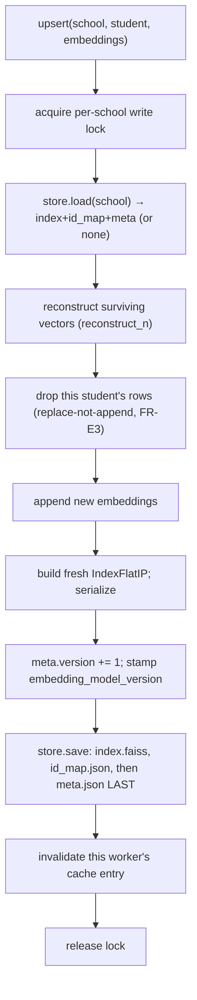
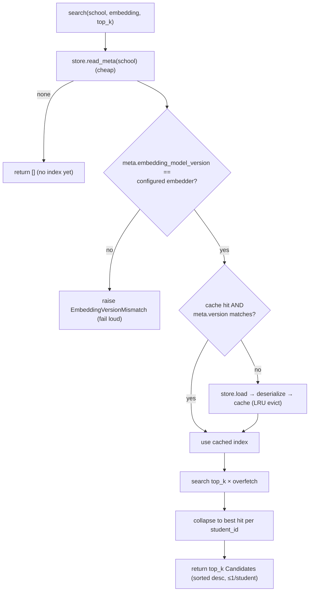

# FAISS index lifecycle

`FaissPerSchoolVectorIndex` implements architecture §7. One `IndexFlatIP` per
school (cosine == inner product on L2-normalized vectors), file-backed via a
pluggable **index store** (`LocalFsIndexStore` for dev / a shared Docker volume,
`SupabaseIndexStore` for prod). See
[0011](../../../decisions/0011-faiss-adapter-lifecycle.md).

## Storage layout (§7.1)

```
{index-store}/school={school_id}/
  index.faiss    # serialized IndexFlatIP
  id_map.json    # row index -> student_id
  meta.json      # {embedding_model_version, dim, metric, version, count, updated_at}
```

`meta.json` is written **last** — it's the commit point. `meta.version` is a
monotonically increasing integer bumped on every write; it's the cache key.

## Write path — upsert / delete (§7.4)

Serialized per school by an in-process lock (Option A). Rebuild-on-write:



`delete` is the same path minus the append; it no-ops if the student isn't present.

## Read path — search (§7.3)



Key invariants:

- **Fail loud on model mismatch** — never search a stale-model index (§7.3).
- **Over-fetch + collapse** — multi-vector enrollment means one student owns many
  rows; the adapter fetches extra, then keeps each student's best, so it honours
  the `VectorIndex.search` contract (≤1 candidate per student). The pure decision
  function re-collapses defensively.
- **Tenant isolation (NFR-3)** — only `school={school_id}` files are ever touched.
- **Cache** — per-worker LRU (default 32 schools); the per-school write lock
  persists across eviction so it stays the serialization point.

## Scale-up hooks

- **Option B (distributed lock)** — swap the in-process lock for a Redis
  `SET NX EX` per school when enrollment must scale beyond one replica (§7.4).
- **Bulk rebuild** on embedder-version change — re-embed into a new prefix and
  flip config (§7.6).
- **`IndexHNSWFlat` / Milvus** — when a school crosses ~100k vectors or file-based
  per-school indexes thrash (req §11); orchestration is untouched.
