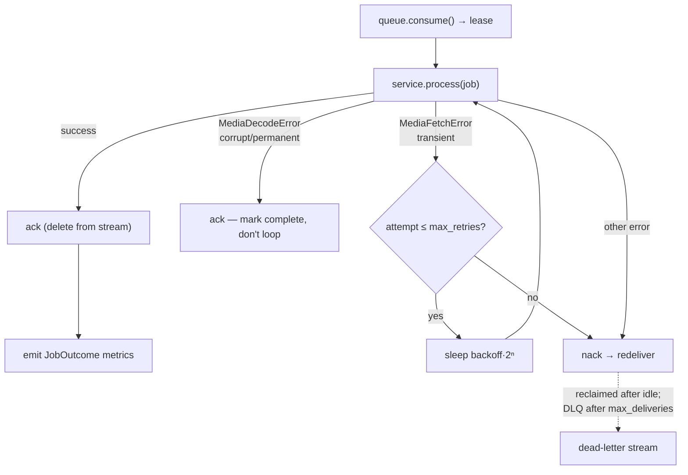

# Inference Worker (Phase 3)

The worker is the async half of the service (architecture §3): a thin loop that
consumes inference jobs from the `JobQueue` and runs each through the shared
`InferenceService`. It owns **delivery semantics only** — the service snapshots
thresholds/versions and does all the work; the runner just decides ack vs. nack
and emits the returned `JobOutcome` as metrics.

## Components

- **`workers/inference_worker.py`** — entrypoint. Builds the container,
  constructs the queue + inference service (models loaded off the loop in a
  thread), and runs the loop until interrupted; disposes the container on exit.
  Each replica must set a unique `ML_QUEUE_CONSUMER` for at-least-once recovery.
- **`workers/runner.py`** — `WorkerRunner`: the consume → process → ack/nack
  state machine with retry/backoff and a pluggable `on_outcome` metrics sink
  (Phase 4 wires Prometheus; the default logs a structured record with the req
  §13 fields).

## Consume / process / ack loop

Mapping to architecture §8.4 failure modes:

| Failure | Behaviour |
|---|---|
| MediaStore fetch fails (`MediaFetchError`) | retry with exponential backoff up to `worker_max_retries`, then `nack` for redelivery |
| Corrupt / undecodable media (`MediaDecodeError`) | `ack` — mark complete, never loop |
| Version mismatch / unexpected error | `nack`; the Redis adapter reclaims it via `XAUTOCLAIM` and routes it to the dead-letter stream once `max_deliveries` is exceeded |
| Redelivery of an already-processed job | harmless — the DB unique `(media_id, student_id)` + in-worker dedupe make processing idempotent (NFR-5) |

## Delivery guarantees

`RedisStreamsJobQueue` gives at-least-once delivery via a consumer group:
`ack` acknowledges **and** deletes the stream entry; `nack` leaves the message
pending so `XAUTOCLAIM` redelivers it after the idle window, dead-lettering it
after `max_deliveries`. `InProcJobQueue` (dev/single-process) implements the same
lease/ack/nack contract with a real `asyncio.Queue` — `nack` re-enqueues.

Because delivery is at-least-once, **idempotency is mandatory** and is enforced in
two layers: the in-worker dedupe keyed on `(student_id, media_id)` and the DB
unique constraint (`save_batch` uses `INSERT … ON CONFLICT`, higher confidence
wins). Re-running the same `media_id` never creates a duplicate row.

## Metrics per job (req §13)

`JobOutcome` carries `faces_detected`, `candidates_above_threshold`,
`matches_emitted`, `ambiguous_matches`, `unknown_faces`, `frames_processed`, the
detector/embedder versions, and the runner adds end-to-end `processing_latency_ms`.
Phase 4 replaces the logging sink with Prometheus counters/histograms (labels
`school_id` + model versions — never `student_id`).
