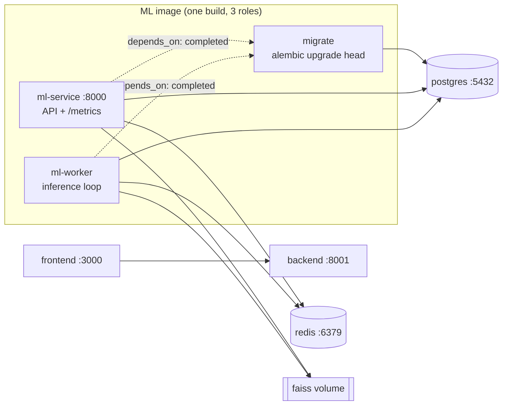

# 08 — Deployment (Docker)

The ML service runs via `docker compose` alongside Postgres and Redis. One image
(`services/ml_service/Dockerfile`) serves all three ML roles; the `command`
selects which. See [decisions/0017](../../../decisions/0017-docker-observability-ci.md).

## Compose topology

- **`migrate`** runs once (`restart: "no"`) and must finish successfully before
  `ml-service`/`ml-worker` start (`depends_on: service_completed_successfully`),
  so the apps only ever see a migrated schema (decisions/0015).
- **FAISS index files** live on a named volume (`faiss`) mounted into both the API
  (writes on enroll) and the worker (reads on inference) — the shared-volume dev
  form of the index store (architecture §7, [06-faiss-lifecycle.md](06-faiss-lifecycle.md)).
  In prod the index store can be pointed at Supabase/S3 instead (`ML_INDEX_STORE_IMPL`).
- The `ml-service` and `ml-worker` services share one env block (YAML anchor
  `&ml-env`) so their configuration can never drift.

Bring it up with `docker compose up --build`, or `./scripts/up.ps1` (infra
detached, apps — including `ml-worker` — in the foreground).

## Model baking

The InsightFace `buffalo_l` bundle (SCRFD detector + ArcFace embedder) is baked
into the image at build time: the Dockerfile fetches the official release zip
with the Python stdlib and extracts the `.onnx` files to `/models/buffalo_l`
(`ML_MODEL_DIR`). No cold-start download; the adapters load `det_10g.onnx` and
`w600k_r50.onnx` from that dir. The bake is independent of the insightface
download API (works across versions).

## CPU default, GPU swap

The base image is CPU-only: `onnxruntime` + `faiss-cpu`. GPU is a documented
config swap, not a redesign:

1. Base the image on an NVIDIA CUDA runtime (e.g. `nvidia/cuda:12.*-runtime`) +
   Python.
2. Replace `onnxruntime` with `onnxruntime-gpu` in the ml-service deps.
3. Pass `providers=["CUDAExecutionProvider", "CPUExecutionProvider"]` and a real
   `ctx_id` to the detector/embedder adapters via config.
4. Run the container with `--gpus all` (compose `deploy.resources.reservations`).

> Local Docker Desktop on Windows has no GPU passthrough — dev stays CPU; GPU is
> for the deployed worker fleet.

## Configuration

All configuration is `ML_`-prefixed env (see `.env.example` and
[04-api.md](04-api.md) for the settings surface). Secrets (`ML_SUPABASE_KEY`, the
DB password inside the DSN) come from the environment / `.env` and are never
committed. Each worker replica gets a unique consumer identity automatically
(`worker-<host>-<pid>`); pin `ML_QUEUE_CONSUMER` only to fix an identity.
