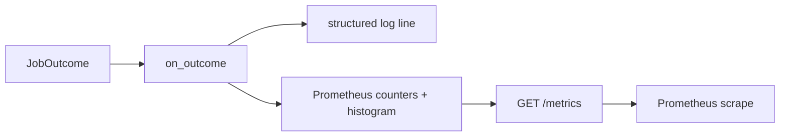

# 09 — Observability

Three pillars, all in `ml_service/observability/`: **metrics** (Prometheus),
**logs** (structlog), **traces** (OpenTelemetry). Wired at the edges (API +
worker), never in the pure layers. See [decisions/0017](../../../decisions/0017-docker-observability-ci.md).

## Metrics (requirements §13)

`metrics.py` defines one counter per §13 signal plus a latency histogram. The
worker folds each finished job's `JobOutcome` into them via
`record_job_outcome`, wired as the runner's `on_outcome` callback; the API
exposes the default registry at **`GET /metrics`**.

| Metric | Type | From `JobOutcome` |
|---|---|---|
| `faces_detected_total` | Counter | `faces_detected` |
| `candidates_above_threshold_total` | Counter | `candidates_above_threshold` |
| `matches_emitted_total` | Counter | `matches_emitted` |
| `ambiguous_matches_total` | Counter | `ambiguous_matches` (needs_review) |
| `unknown_faces_total` | Counter | `unknown_faces` |
| `frames_processed_total` | Counter | `frames_processed` (video) |
| `processing_latency_ms` | Histogram | end-to-end job latency |

**Labels:** `school_id`, `detector_model_version`, `embedding_model_version` —
all bounded. **Never** `student_id` or `media_id` (unbounded → cardinality bomb,
req §13 note).

## Logging

`logging.py::configure_logging(level, json_output)` routes stdlib `logging`
(uvicorn/sqlalchemy/redis) through structlog into one pipeline. JSON by default
(for Loki/OTel collectors); `ML_LOG_JSON=false` gives human-readable console logs
for local dev. Called from the API lifespan and the worker entrypoint
(idempotent). Log records carry `school_id`/`event_id`/`media_id` and the model
versions — the same low-cardinality dimensions as the metrics.

## Tracing (opt-in)

`tracing.py::configure_tracing(service_name, otlp_endpoint)` installs an OTel SDK
`TracerProvider` with an OTLP/HTTP exporter **only** when
`ML_OTEL_EXPORTER_OTLP_ENDPOINT` is set; otherwise the global API returns a no-op
tracer and `span(...)` costs nothing. v1 instruments at the **service-call
boundary** (the worker's `inference.process` span, with `school_id`/`media_id`/
`attempt` attributes) rather than wrapping every port call — that keeps
orchestration/domain import-pure and leaves the Phase 2 adapters untouched.

**Deferred:** per-adapter spans (one span per port call). The clean way is a
tracing proxy applied in `wiring/container.py` so adapters stay unaware; recorded
as future work in decisions/0017.

## Configuration summary

| Env var | Default | Effect |
|---|---|---|
| `ML_LOG_JSON` | `true` | JSON logs vs. console renderer |
| `ML_LOG_LEVEL` | `INFO` | Root/structlog level |
| `ML_OTEL_EXPORTER_OTLP_ENDPOINT` | `""` | Enable tracing to this OTLP/HTTP endpoint |
